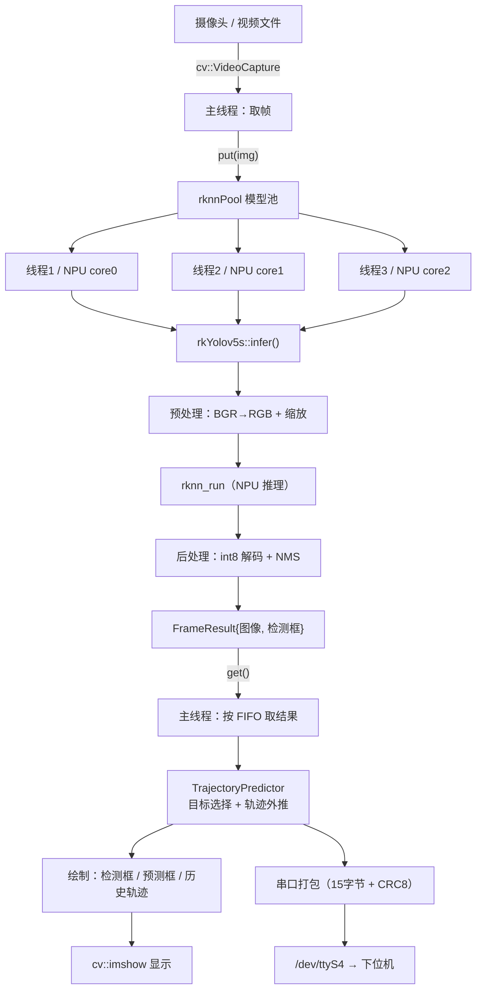

# 第 01 章 · 工程概览与学习路径

## 本章目标

- 搞清楚这个工程**要做什么**、跑在什么硬件上
- 理解**目录结构**和**三个关键设计决策**
- 拿到一份明确的**学习路线图**，知道每个章节学什么、为什么排在这个顺序
- 了解**当前进度**和**已知待解决的问题**

---

## 1.1 这个工程是什么

**一句话**：在 RK3588 开发板上跑 **YOLOv5 目标检测**，用**多线程 + 多 NPU 核心**把帧率榨到极限；检测结果经过**轨迹预测**后，算出目标相对画面中心的偏差，通过**串口**发给下位机（云台 / 舵机 / 小车）。

### 数据流全貌



### 关键指标

| 指标 | 目标 / 现状 |
|---|---|
| 推理帧率 | 单线程 ~41 fps；3 线程 ~98 fps（RK3588 有 3 个 NPU 核） |
| 端到端延迟 | 设计目标 ≤ 1 轮循环（约 20ms） |
| 串口协议 | 15 字节二进制包，CRC-8 (poly 0x31) |
| 模型 | 自定义单类模型 `best.rknn`，640×640 输入 |

---

## 1.2 硬件与运行环境

| 项目 | 值 | 备注 |
|---|---|---|
| 开发板 | Orange Pi 5（RK3588S） | 3 个 NPU 核心 |
| 操作系统 | Ubuntu 20.04.6 LTS (focal), aarch64 | |
| SSH | 别名 `board`（`ssh board` 直接用，免密已配） | IP 由 DHCP 动态分配，**变了见《开发流程与常用指令》§1.4** |
| 编译器 | GCC / G++ 9.4.0 | |
| CMake | **3.16.3** | ⚠️ apt 版本，`cmake_minimum_required` 不能高于此 |
| OpenCV | 4.2.0（`libopencv-dev`） | |
| NPU 驱动 | rknpu **0.9.8** (20240828) | 通过 **DRM** 暴露，**没有** `/dev/rknpu` |
| NPU 运行时 | `include/librknnrt.so`（随工程携带） | |
| RGA | `/dev/rga` ✅ | 硬件 2D 加速 |
| 串口 | `/dev/ttyS4` @115200 ✅ | |
| 摄像头 | ❌ **当前没有** | `/dev/video-dec0`、`video-enc0` 是硬件编解码器，不是摄像头；测试要用**视频文件** |

### 硬件自检命令

```bash
lsb_release -a && uname -m                    # 系统
which cmake gcc g++ make                      # 工具链
pkg-config --modversion opencv4               # OpenCV
ls -l /dev/dri/                               # NPU（DRM 方式）
dmesg | grep -i rknpu | tail -3               # NPU 驱动日志
ls -l /dev/rga /dev/ttyS4                     # RGA / 串口
ls -l /dev/video*                             # 摄像头
```

---

## 1.3 目录结构

```
new/                                    ← PC 上的工程（唯一真源）
├── CMakeLists.txt                      ★ 顶层构建定义
├── src/
│   └── main.cc                         （当前只有占位内容，业务代码待手写）
├── include/
│   ├── rknn_api.h                      RKNN SDK 头文件
│   ├── librknnrt.so                    ★ NPU 用户态运行时（随包分发）
│   ├── rknnPool.hpp                    ★ 模型池模板（线程池 + 多实例）
│   ├── ThreadPool.hpp                  dpool 线程池（第三方，MIT）
│   ├── rkYolov5s.hpp                   ★ 单模型封装
│   ├── FrameResult.hpp                 帧结果结构体
│   ├── coreNum.hpp                     NPU 核心轮转分配
│   ├── postprocess.h / preprocess.h    后处理 / 预处理接口
│   ├── trajectory_predictor.hpp        轨迹预测
│   ├── uart.h                          串口接口
│   └── 3rdparty/rga/RK3588/
│       ├── include/                    im2d.h / rga.h 等
│       └── lib/Linux/aarch64/librga.so ★ RGA 库
├── model/
│   ├── coco_80_labels_list.txt         标签文件（路径被硬编码引用）
│   └── RK3588/{best.rknn, yolov5s-640-640.rknn}
├── docs/                               本文档目录
└── tools/
    └── sync.ps1                        ★ 一键同步脚本
```

> ★ = 核心文件

---

## 1.4 三个关键设计决策

### 决策 1：PC 是唯一真源，板子只读

```
PC (Windows, VS Code 本地模式)  ← 唯一编辑地、唯一提交者
      │  git push
      ▼
板子 ~/myproj.git (裸仓库，中转站)
      │  git pull --ff-only
      ▼
板子 ~/myproj (只读工作副本) → cmake 编译 → 运行验证
```

**为什么**：
- 本地编辑全速响应（VS Code 的搜索/跳转/补全），板子只负责跑
- 之前用「本地编辑 + scp 上传 + 偶尔在 SSH 里改」的混用模式，出现过**同一文件被两个来源反复覆盖**，导致"改了却不生效"
- 走 Git 之后，"哪个是最新"由 commit 历史回答，不再靠文件时间戳猜

### 决策 2：多线程 = 多模型实例 + 多 NPU 核心

不是"一个模型多线程共享"，而是 **N 个独立 `rknn_context`（权重共享）+ N 个线程**：

| 机制 | 实现 |
|---|---|
| 权重共享（省内存） | 第一个实例 `rknn_init`，其余 `rknn_dup_context` |
| 核心绑定 | `rknn_set_core_mask`，按 `core_num++ % 3` 轮转 core0/1/2 |
| 实例轮转 | `id++ % threadNum` 决定第 N 帧交给哪个实例 |
| 结果顺序 | `std::queue<std::future<T>>` FIFO，保证输出顺序 = 输入顺序 |

### 决策 3：用「在途帧数上限」换取低延迟

**延迟公式**（本项目最重要的性能直觉）：

$$ \text{端到端延迟} \approx \text{在途帧数} \times \text{主循环单轮耗时} $$

- `threadNum` 决定**吞吐上限**（能并行几帧）
- 主循环是"一进一出"配对，所以不限制时在途帧数会稳定在 `threadNum`
- 加了 `setMaxPending(2)` 之后，吞吐和延迟**解耦**：既开 3 个线程吃满 NPU，又把延迟压到约 1 轮
- 代价是多余的在途帧被主动丢弃（`dropped` 计数持续增长是**正常**的）

---

## 1.5 ⭐ 学习路线图与章节分配

后面的章节**按这个顺序**推进，每章都建立在前一章之上：

| 章 | 主题 | 学完能做什么 | 前置 | 状态 |
|---|---|---|---|---|
| **01** | 工程概览与学习路径 | 说清工程要做什么、整体怎么跑 | — | ✅ |
| **02** | 构建与环境配置 | 独立配置 CMake / SSH / Git 环境，看懂 `CMakeLists.txt` | 01 | ✅ |
| **03** | RKNN 推理基础 | 加载 `.rknn` 模型、绑 NPU 核心、用 RGA 做预处理 | 02 | ⏳ |
| **04** | YOLOv5 后处理 | 从 int8 输出解码出检测框、做 NMS | 03 | ⏳ |
| **05** | 多线程推理流水线 | 实现模型池 + 线程池，理解吞吐/延迟权衡 | 03, 04 | ⏳ |
| **06** | 业务功能 | 串口协议设计 + 轨迹预测 | 05 | ⏳ |
| **07** | 调试与性能优化 | 定频测性能、定位瓶颈、分析帧率与延迟 | 05, 06 | ⏳ |

### 为什么是这个顺序


**核心原则：先把单帧单线程跑通并验证正确，再上多线程。** 否则你会同时面对"CMake 配错了"、"后处理写错了"、"多线程有竞争"三类问题，无法定位。

### 每章的交付物

| 章 | 交付物 |
|---|---|
| 02 | 可一键构建的 `CMakeLists.txt` + 可用的 `sync.ps1` |
| 03 | `src/rkYolov5s.cc` 的 `init()` 能加载模型并打印属性 |
| 04 | 对一张测试图能画出正确的检测框 |
| 05 | 3 线程下帧率 ≥ 90 fps，延迟 ≤ 30 ms |
| 06 | 下位机能收到并解析 15 字节包 |
| 07 | 有一份定频下的帧率/延迟基线数据 |

---

## 1.6 当前进度

| 项目 | 状态 |
|---|---|
| CMakeLists.txt 重构（第 0~5 步） | ✅ 完成并在板子验证 |
| 开发环境（SSH 免密 / 别名 / Git 三仓库 / sync.ps1） | ✅ 完成并跑通 |
| 文档体系（本目录） | ✅ 第 01、02 章 + 附录 A |
| `src/` 业务代码 | ⏳ 仅占位 `main.cc`，用户手写中 |

### CMakeLists 已完成的 6 项改进

| # | 改进 | 解决什么 |
|---|---|---|
| 0 | 补 `CMAKE_BUILD_TYPE` 默认值 | 原来一直是 `-O0`（性能腰斩） |
| 1 | `include_directories` → `target_include_directories` | 消除全局污染 + 两条无效路径 |
| 2 | OpenCV 写全组件 + `PRIVATE` 签名 | 防止"编译过、链接炸" |
| 3 | `CMAKE_EXE_LINKER_FLAGS` → `target_link_options` | 作用域从全局收到目标 |
| 4 | `install` 语义规范化 | `.so` 权限 755→644；修 `install(FILES "")` 报错 |
| 5 | 语言标准 / `compile_commands.json` / 架构变量 / 死代码清理 | 收尾 |

---

## 1.7 已知待解决的问题（来自旧工程的分析）

> 这些是**参考旧工程代码**总结出来的，自己重写时要主动避开。

| # | 问题 | 现象 | 属于哪章 |
|---|---|---|---|
| 1 | **串口双协议冲突** | worker 线程发文本行（`count:N\nname,x1,y1...`）+ 主线程发 15 字节二进制包，两者在同一串口交错，且时序相差数帧 → 下位机无法可靠解析 | 06 |
| 2 | **预处理没用 letterbox** | `letterbox()` 函数写好了却从没被调用，实际是 RGA 直接拉伸 → 长宽比失真 → 精度下降 | 03 |
| 3 | **轨迹预测假设等帧间隔** | `v = (p3-p1)/2` 把相邻帧当等时间间隔，一旦丢帧速度估计就偏 | 06 |
| 4 | **后处理静态初始化非线程安全** | `post_process()` 里 `static int init` + `loadLabelName()`，多线程首帧可能并发 | 04 |
| 5 | **标签路径硬编码** | `LABEL_NALE_TXT_PATH = "./model/coco_80_labels_list.txt"`，必须 `cd` 到安装目录才能跑 | 04 |
| 6 | **`OBJ_CLASS_NUM=1` 但读 80 行标签** | 所有结果 `name` 都是 `person`；换模型必须改 | 04 |
| 7 | **输出个数硬编码为 3** | `outputs[0..2]`，换模型若输出数不同会越界 | 04 |
| 8 | **`ThreadPool::worker` 空队列 `front()`** | 虚假唤醒等情况下 `tasks_.front()` 取空队列 → UB | 05 |

---

## 1.8 自测问题

学完本章，试着回答：

1. 这个工程的输入端和输出端分别是什么？（提示：一端是画面，一端是串口包）
2. 为什么要"多模型实例"而不是"一个模型多线程共享"？（提示：NPU 核心绑定）
3. 如果 `threadNum` 从 3 改成 12，帧率会上升但什么问题会恶化？为什么？
4. 为什么说"先单帧单线程跑通，再上多线程"？
5. 板子上为什么没有 `/dev/rknpu` 却仍然能用 NPU？

---

## 下一章

**[第 02 章 · 构建与环境配置](02-构建与环境配置.md)**
—— 讲清 CMake 的四阶段模型与变量作用域，逐块解析本工程的 `CMakeLists.txt`，然后配置 SSH 免密 + 别名 + Git 三仓库工作流。
