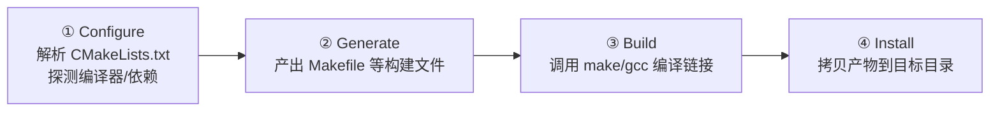
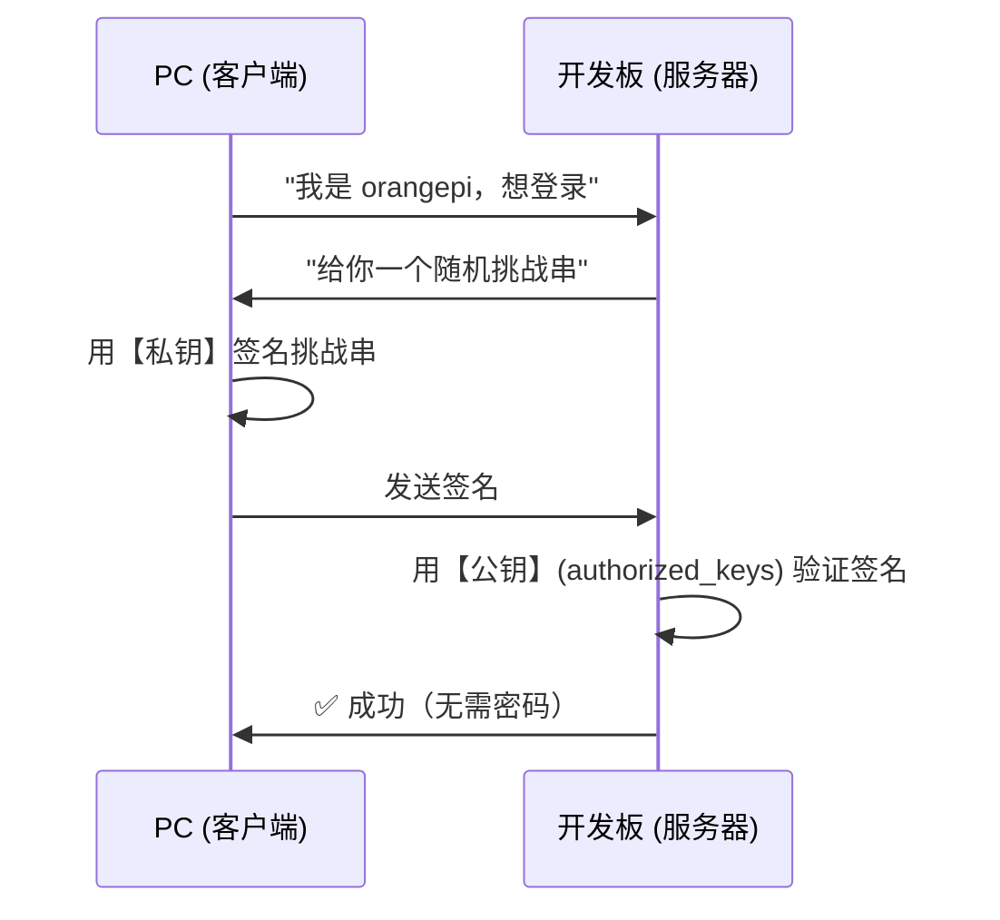

# 第 02 章 · 构建与环境配置

## 本章目标

学完能独立做到：

1. 说清 CMake 的**四个阶段**和**两种作用域**，看懂任何一份 `CMakeLists.txt`
2. 配好 **SSH 免密 + 别名**，用 `ssh board` 一句话连上板子
3. 搭好 **PC → 裸仓库 → 板子** 的 Git 工作流，用一条命令完成"同步+编译+安装"
4. 遇到构建/连接问题时，知道**去哪里找答案**

> 配套参考：**附录 A《开发流程与常用指令》** 是操作速查表，本章讲原理。

---

# Part A · CMake 构建系统

## A.1 CMake 的四个阶段



对应的命令：

| 阶段 | 命令 | 什么时候需要重新执行 |
|---|---|---|
| ①+② | `cmake -B build -S .` | 首次；**改了 `CMakeLists.txt`**；新增/删除源文件 |
| ③ | `cmake --build build -j8` | 每次改代码 |
| ④ | `cmake --install build` | 需要更新部署目录时 |

**关键推论**：

> `cmake --install` 执行的是 `build/cmake_install.cmake`，而它是在阶段②生成的。
> **所以改了 `install()` 规则后，必须先重新 `cmake -B build -S .`，否则用的是旧规则。**

## A.2 ⭐ 两种作用域（理解现代 CMake 的唯一钥匙）

CMake 的命令分成两类：

| | 目录级（旧） | 目标级（新，推荐） |
|---|---|---|
| 头文件路径 | `include_directories()` | `target_include_directories()` |
| 链接库 | `link_directories()` | `target_link_libraries()` |
| 预处理宏 | `add_definitions()` | `target_compile_definitions()` |
| 编译选项 | `add_compile_options()` | `target_compile_options()` |
| 链接选项 | `set(CMAKE_EXE_LINKER_FLAGS ...)` | `target_link_options()` |
| **作用范围** | 当前目录 + 所有子目录里**之后创建的所有目标** | **只有你指定的那一个目标** |

**一句话记法**：

> 目录级命令 = 全局变量；目标级命令 = 成员变量。

**为什么必须用目标级**：

1. 一个工程有多个目标时，目录级会把某个目标私有的路径强加给所有目标
2. 目录级没有"传递性"概念，无法表达依赖是私有还是公开
3. `-I` 从哪来难以追踪；目标级可以用 `flags.make` 直接看到
4. 现代 CMake 的整个依赖模型都建立在目标级之上

**顺序规则**：`target_*` 命令必须写在 `add_executable` **之后**（目标得先存在），否则报：

```
Cannot specify include directories for target "xxx" which is not built by this project.
```

### `PRIVATE` / `PUBLIC` / `INTERFACE`

| 关键字 | 含义 | 什么时候用 |
|---|---|---|
| `PRIVATE` | 只给我自己用，不传给链接我的人 | **默认选它**；可执行文件、库的内部实现 |
| `PUBLIC` | 我自己用，同时传给链接我的人 | 我的**头文件**里 `#include` 了它 |
| `INTERFACE` | 我自己不用，但链接我的人要用 | 纯头文件库 |

---

## A.3 本工程 `CMakeLists.txt` 逐块解析

```cmake
# ① 版本与工程
cmake_minimum_required(VERSION 3.16)              # ⚠️ 不能高于板上的 3.16.3
project(my_rknn_yolov5_demo VERSION 1.0.0 LANGUAGES C CXX)
#                                                 ↑ 有 uart.c，必须启用 C 语言
# ② 语言标准
set(CMAKE_CXX_STANDARD 14)
set(CMAKE_CXX_STANDARD_REQUIRED ON)              # 不支持时直接报错，而不是静默降级
set(CMAKE_CXX_EXTENSIONS OFF)                    # -std=c++14（而非 gnu++14）

# ③ 构建类型（🔴 最容易漏的一步）
if(NOT CMAKE_BUILD_TYPE AND NOT CMAKE_CONFIGURATION_TYPES)
    set(CMAKE_BUILD_TYPE Release CACHE STRING "构建类型" FORCE)
    set_property(CACHE CMAKE_BUILD_TYPE PROPERTY STRINGS Debug Release RelWithDebInfo MinSizeRel)
endif()
# CMAKE_BUILD_TYPE 为空时，所有 CMAKE_<LANG>_FLAGS_<CONFIG> 都不生效 → 编译出来是 -O0

set(CMAKE_EXPORT_COMPILE_COMMANDS ON)            # 生成 compile_commands.json 供 IDE/clangd

# ④ 自包含部署包
set(CMAKE_INSTALL_PREFIX "${CMAKE_SOURCE_DIR}/install/${PROJECT_NAME}_${CMAKE_SYSTEM_PROCESSOR}"
    CACHE PATH "安装前缀" FORCE)
set(CMAKE_SKIP_INSTALL_RPATH FALSE)
set(CMAKE_BUILD_WITH_INSTALL_RPATH TRUE)
set(CMAKE_INSTALL_RPATH "$ORIGIN/lib")           # ★ 见 A.4 坑 2

# ⑤ 第三方依赖
set(RKNN_RT_LIB "${CMAKE_SOURCE_DIR}/include/librknnrt.so")
set(RGA_PATH "${CMAKE_SOURCE_DIR}/include/3rdparty/rga/RK3588")
set(RGA_LIB  "${RGA_PATH}/lib/Linux/${CMAKE_SYSTEM_PROCESSOR}/librga.so")
#                                        ↑ 用架构变量，不硬编码 aarch64

# ⑥ 依赖包
find_package(OpenCV 4 REQUIRED COMPONENTS core imgproc highgui videoio imgcodecs)
find_package(Threads REQUIRED)
#             ↑ 提供导入目标 Threads::Threads，自动带上 -pthread（编译+链接）

# ⑦ 目标
add_executable(my_rknn_yolov5_demo
        src/main.cc
        # src/postprocess.cc        ← 还没写的先注释掉（CMake 要求列出的文件必须存在）
)

target_include_directories(my_rknn_yolov5_demo PRIVATE
        ${CMAKE_SOURCE_DIR}/include
        ${RGA_PATH}/include          # im2d.h / rga.h 在这里
)

target_link_libraries(my_rknn_yolov5_demo PRIVATE
        ${RKNN_RT_LIB} ${RGA_LIB} ${OpenCV_LIBS} Threads::Threads)

target_link_options(my_rknn_yolov5_demo PRIVATE -Wl,--allow-shlib-undefined)

# ⑧ 安装
install(TARGETS my_rknn_yolov5_demo RUNTIME DESTINATION .)
install(FILES ${RKNN_RT_LIB} ${RGA_LIB} DESTINATION lib)
install(DIRECTORY model DESTINATION .)           # ★ 不能加结尾斜杠，见 A.4 坑 4
```

---

## A.4 六个必须记住的坑

### 🔴 坑 1：没有 `CMAKE_BUILD_TYPE` → 编译出来是 `-O0`

```cmake
set(CMAKE_CXX_FLAGS_RELEASE "${CMAKE_CXX_FLAGS_RELEASE} -O3 -DNDEBUG")   # 单独写这行没用！
```

`CMAKE_CXX_FLAGS_RELEASE` **只在 `CMAKE_BUILD_TYPE=Release` 时才被使用**。单配置生成器（Makefile / Ninja）下 `CMAKE_BUILD_TYPE` 默认是**空**，所以这句是死代码。

**验证**：
```bash
grep -o '\-O[0-9]' build/CMakeFiles/<target>.dir/flags.make | sort -u
```
- 什么都不输出 → 你在编 `-O0`
- `-O3` → 正常

> 补充：GCC 下 `Release` 的默认值**本来就是** `-O3 -DNDEBUG`，所以不需要手工追加，否则会出现 `-O3 -DNDEBUG -O3 -DNDEBUG`（无害但冗余）。

### 🔴 坑 2：RPATH 用绝对路径或相对 CWD 的路径

```cmake
set(CMAKE_INSTALL_RPATH "${CMAKE_INSTALL_PREFIX}/lib")   # ❌ 目录一移动就失效
set(CMAKE_INSTALL_RPATH "lib")                           # ❌ 相对"当前工作目录"，必须 cd 到安装目录
set(CMAKE_INSTALL_RPATH "$ORIGIN/lib")                   # ✅ $ORIGIN = 可执行文件自身所在目录
```

**RPATH 的语义**：
- 相对路径的 RPATH 是**相对进程的 CWD**，不是相对可执行文件！所以 `"lib"` 意味着"在 `./lib` 里找"，必须 `cd` 到安装目录才能跑
- `$ORIGIN` 由动态加载器展开为**可执行文件所在的绝对目录**，所以目录随便拷贝/改名都能跑

**验证**：
```bash
readelf -d <可执行文件> | grep -iE 'rpath|runpath'
# 期望: (RUNPATH) Library runpath: [$ORIGIN/lib]
```

> `RUNPATH`（新式 `DT_RUNPATH`）与旧式 `RPATH` 的区别：`RUNPATH` 的搜索优先级**低于** `LD_LIBRARY_PATH`，且**不传递给间接依赖**。现代 binutils 默认用新式。

### 🟠 坑 3：OpenCV 组件按"头文件"选而不是按"符号所在的库"选

```cmake
find_package(OpenCV 4 REQUIRED COMPONENTS core imgproc highgui videoio imgcodecs)
```

**最阴险的地方**：OpenCV 4 的 `opencv2/highgui.hpp` 内部 `#include` 了 `videoio.hpp` 和 `imgcodecs.hpp`，所以：

| 只链接 `highgui` 时 | 结果 |
|---|---|
| 编译 | ✅ 通过（头文件找得到） |
| 链接 | ❌ `undefined reference to cv::VideoCapture::VideoCapture()` |

**教训：组件列表要按"符号在哪个 `.so` 里"来写。**

顺带：不写 `COMPONENTS` 会把 OpenCV 全部模块都当依赖；写了 `COMPONENTS` 且某个模块没装，会在**配置期**就报错（比链接期报错好得多）。

**报错越早越好**：配置期 > 编译期 > 链接期 > 运行期。

### ⭐ 坑 4：`install(DIRECTORY)` 的结尾斜杠

```cmake
install(DIRECTORY model  DESTINATION .)    # → <prefix>/model/xxx.rknn      ✅
install(DIRECTORY model/ DESTINATION .)    # → <prefix>/xxx.rknn            ❌ 丢掉 model/ 这一层
```

**有斜杠 = 拷贝"内容"；无斜杠 = 拷贝"目录本身"。**

**为什么对本工程致命**：`postprocess.cc` 里硬编码了

```cpp
#define LABEL_NALE_TXT_PATH "./model/coco_80_labels_list.txt"
```

加了斜杠 → 运行时报 `Open ./model/coco_80_labels_list.txt fail!` → `post_process()` 返回 -1 → **所有检测结果丢失**（且不一定崩溃，只是"什么都检测不到"，极难排查）。

### 🟡 坑 5：`install(FILES)` 给空字符串或目录

```cmake
install(FILES "" ${A} ${B} DESTINATION lib)     # ❌ install FILES given directory "" to install.
```

- `FILES` 后面每个参数都被当成**文件路径**
- `""` 空字符串解析成一个空路径 → 指向目录 → `install(FILES)` 不接受目录 → 报错
- 目录要用 `install(DIRECTORY)`

### 🟡 坑 6：`install(PROGRAMS)` vs `install(FILES)`

| 形式 | 权限 | 适用 |
|---|---|---|
| `install(PROGRAMS ...)` | **755** | 可执行文件、脚本 |
| `install(FILES ...)` | **644** | 普通文件、**共享库 `.so`** |
| `install(TARGETS ... RUNTIME DESTINATION .)` | 按类型自动 | 构建产物 |

`.so` 用 `PROGRAMS` 不报错，但会带上不该有的执行位。

**验证**：`ls -l install/*/lib/` → 期望 `-rw-r--r--`

### 附：`install(TARGETS)` 的类型关键字

| 关键字 | 对应什么 |
|---|---|
| `RUNTIME` | 可执行文件 + Windows DLL |
| `LIBRARY` | 共享库（Linux `.so`） |
| `ARCHIVE` | 静态库（`.a`） |

不写类型关键字（旧式 `install(TARGETS t DESTINATION .)`）也能用，但明确写出来语义更清楚。

---

## A.5 排查三件套（最常用的调试文件）

| 文件 | 内容 | 用来回答 |
|---|---|---|
| `build/CMakeFiles/<target>.dir/flags.make` | 编译命令的所有 `-I` / `-D` / `-O` | "这个 `-I` 是谁加的？""优化开了吗？" |
| `build/CMakeFiles/<target>.dir/link.txt` | 完整的链接命令 | "链接了哪些 `.so`？顺序如何？rpath 是什么？" |
| `readelf -d <可执行文件>` | 二进制的动态段 | "RPATH 是什么？依赖哪些库？" |

**辅助命令**：

```bash
grep -o '\-I[^ ]*' <flags.make> | sort -u          # 列出所有头文件搜索路径
grep -o '\-std=[^ ]*' <flags.make>                 # 语言标准
grep -o 'allow-shlib-undefined' <link.txt>         # 链接选项是否生效
ldd <可执行文件>                                    # 运行期能否找到动态库
file <可执行文件>                                   # 架构（ELF ... ARM aarch64）
```

---

## A.6 交叉编译（了解即可，本工程不用）

本工程是**在板子上原生编译**的，所以不需要交叉编译。但如果你以后想在 PC 上编译：

**需要一个 toolchain 文件**（如 `cmake/toolchain-aarch64.cmake`），核心是 5 个变量：

```cmake
set(CMAKE_SYSTEM_NAME      Linux)          # 声明这是交叉编译（必须最先设）
set(CMAKE_SYSTEM_PROCESSOR aarch64)
set(CMAKE_C_COMPILER   aarch64-linux-gnu-gcc)
set(CMAKE_CXX_COMPILER aarch64-linux-gnu-g++)
set(CMAKE_SYSROOT /opt/rk3588-sysroot)     # 目标板 rootfs 副本
set(CMAKE_FIND_ROOT_PATH_MODE_LIBRARY ONLY)  # 库只在 sysroot 里找
```

用法：`cmake -B build -DCMAKE_TOOLCHAIN_FILE=cmake/toolchain-aarch64.cmake`

**三条铁律**：
1. toolchain 文件由 `-DCMAKE_TOOLCHAIN_FILE=` 指定，**在 `project()` 之前**被读取
2. 文件里**绝不能**写 `project()` / `find_package()` —— 它会被 `try_compile` 重复 include
3. 改了编译器设置后**必须删除构建目录**重来（编译器路径进了 `CMakeCache.txt`）

---

# Part B · SSH 免密与别名

## B.1 免密登录的原理



**关键点**：
- **私钥永远不离开你的电脑**（`~/.ssh/id_ed25519`），签名在本地完成
- 板子上只需要你的**公钥**（`~/.ssh/authorized_keys`）
- 服务器不可能反向推导出私钥

## B.2 配置步骤

### ① PC 生成密钥对（已有则跳过）

```powershell
ssh-keygen -t ed25519 -C "windows-pc"     # 一路回车，密码留空
```

### ② 把公钥装到板子

```powershell
type $env:USERPROFILE\.ssh\id_ed25519.pub | ssh orangepi@192.168.3.226 "mkdir -p ~/.ssh && chmod 700 ~/.ssh && cat >> ~/.ssh/authorized_keys && chmod 600 ~/.ssh/authorized_keys"
```

### ③ ⭐ 配置别名（省掉一长串 IP 和用户名）

编辑 `C:\Users\<用户名>\.ssh\config`：

```ssh-config
Host board                  # ← 这里写的是"别名"，名字随便起
    HostName 192.168.3.226  # ← 这里才是真正的 IP / 域名
    User orangepi
    IdentityFile ~/.ssh/id_ed25519
    ServerAliveInterval 30
    ServerAliveCountMax 6
```

### 🔴 最容易搞错的点：`Host` 是别名，不是 IP

| 写法 | 能用的命令 | `ssh board` 会怎样 |
|---|---|---|
| `Host board` + `HostName 192.168.3.226` | `ssh board` ✅ | 正常 |
| `Host 192.168.3.226` + `HostName 192.168.3.226` | `ssh 192.168.3.226` | ❌ `Could not resolve hostname board` |

**其他注意**：
- **文件名必须是 `config`**，存成 `config.txt` 无效（SSH 只读 `config`）
- 改完 config 后，**已经开着的终端不会重新读取** → 重开一个 PowerShell

## B.3 别名带来的收益

| 原命令 | 简写 |
|---|---|
| `ssh orangepi@192.168.3.226` | `ssh board` |
| `scp f.txt orangepi@192.168.3.226:~/` | `scp f.txt board:~/` |
| `git clone orangepi@192.168.3.226:~/myproj.git` | `git clone board:~/myproj.git` |
| VS Code Remote-SSH 主机 | `board` |

---

# Part C · Git 三仓库工作流

## C.1 模型

```
┌──────────────────────────────────┐   push    ┌───────────────────────────┐
│ PC: E:\desk\学习\C++\mytest\new    │ ────────► │ 板子: ~/myproj.git (裸仓库) │
│      ← 唯一真源，唯一提交者          │  board    │      ↑                    │
└──────────────────────────────────┘           └──────┼────────────────────┘
                                                       │ pull --ff-only
                                                       ▼
                                            ┌───────────────────────────┐
                                            │ 板子: ~/myproj (工作副本)   │
                                            │      ← 只读，永不提交        │
                                            └───────────────────────────┘
```

| 仓库 | 角色 | 允许的操作 |
|---|---|---|
| PC `new/` | **真源** | 一切 |
| 板子 `~/myproj.git` | 中转站（裸仓库） | 接收 push、被 clone |
| 板子 `~/myproj` | 只读部署目标 | **只允许** `git pull --ff-only`、`git log`、`git status` |

### ⚠️ 板子"只读"原则（最重要）

**一旦板子上产生了提交，PC 的 `git push` 就会因 non-fast-forward 被拒绝。**

板子上：✅ `git pull --ff-only`、`git log`、`git status`、`git reset --hard`（对齐用）
板子上：❌ `git commit`、`git add`、直接编辑源码

## C.2 一次性配置

**板子上建裸仓库**（详见附录 A §5.4）：
```bash
cd ~/myproj && git init && git add -A && git commit -m "init"
git clone --bare ~/myproj ~/myproj.git
```

**PC 上接管**：
```powershell
cd "E:\desk\学习\C++\mytest\new"
git init
git config user.name "..." ; git config user.email "..."
git add -A ; git commit -m "PC 成为真源"
git branch -M master                    # 分支名必须与板子一致
git remote add board board:~/myproj.git
git push -f board master                # 首次需要 -f
```

**板子上重新克隆对齐**：
```bash
cd ~ && rm -rf myproj && git clone ~/myproj.git myproj
```

## C.3 日常：一条命令

```powershell
cd "E:\desk\学习\C++\mytest\new"
.\tools\sync.ps1 -Message "这次改了什么"
```

脚本内部 4 步：`git commit` → `git push` → 板子 `git pull` + `cmake -B build -S .` + `cmake --build` → 板子 `cmake --install`。

> 参数说明：`-Message` 后面**必须跟一个值**（`-Message` 单独出现会报"缺少参数"）。
> 不写 `-Message` 时脚本自动用时间戳当提交信息。

---

# Part D · PowerShell 脚本要点

`.ps1` 就是**一个纯文本文件，里面按顺序写着终端命令**。终端里能做的一切，脚本里都能做。

## D.1 五个能力

| 能力 | 语法 | 说明 |
|---|---|---|
| 顺序执行 | 一行一行 | 基础 |
| 变量 | `$BOARD = "board"` | 改一处即可 |
| 参数 | `param([string]$Message, [switch]$NoBuild)` | 让一个脚本按需工作 |
| 流程控制 | `if (-not $dirty) { ... }` | 分支 |
| **判断成败** ⭐ | `if ($LASTEXITCODE -ne 0) { exit 1 }` | 外部命令失败时中断 |

**`$LASTEXITCODE`**：保存上一条**外部命令**（git/ssh/cmake）的退出码，`0` 表示成功。没有它，脚本会"失败了还继续跑"，最后的报错和真正原因对不上。

**`$PSScriptRoot`**：脚本自身所在目录，用来引用同目录的其他脚本。

## D.2 五个坑

| # | 坑 | 现象 | 解法 |
|---|---|---|---|
| 1 | **编码** | 中文乱码 → 引号错位 → 一堆语法错误 | 存成 **UTF-8 with BOM** |
| 2 | **执行策略** | `禁止运行脚本` | `Set-ExecutionPolicy -Scope CurrentUser RemoteSigned` |
| 3 | **`&&` 不支持** | PS 5.1 报"意外的标记" | 用 `;`；要传给板子 bash 的 `&&` 放进引号里 |
| 4 | **路径带空格/中文** | 参数被拆开 | 加双引号 |
| 5 | **原生命令失败不中断** | 报错后继续跑 | 检查 `$LASTEXITCODE` |

### 修编码的通用命令（PS 5.1 / 7 都适用）

```powershell
$p = "路径\到\脚本.ps1"
$c = [System.IO.File]::ReadAllText($p, [System.Text.Encoding]::UTF8)
[System.IO.File]::WriteAllText($p, $c, (New-Object System.Text.UTF8Encoding $true))
```

> 用 .NET API 而不是 `Set-Content -Encoding UTF8`，因为后者在 PowerShell 7 里**不写 BOM**，行为不一致。

---

# 本章踩过的坑汇总

| 现象 | 原因 | 解法 |
|---|---|---|
| `CMakeLists.txt does not appear to contain CMakeLists.txt` | 文件名大小写错（`CmakeLists.txt`） | Linux 区分大小写，改名 |
| `cmake: 未找到命令` | 板子没装 | `apt install cmake build-essential libopencv-dev` |
| `Cannot find source file` | `add_executable` 列了不存在的文件 | 注释掉或创建 |
| `没有指明目标并且找不到 makefile` | 上一步 generate 失败 | 修好错误后 `rm -rf build` |
| `install FILES given directory ""` | `install(FILES "")` 里的空字符串 | 删掉 `""` |
| `! [rejected] non-fast-forward` | 板子上有本地提交 | 板子 `git reset --hard origin/master` |
| `Could not resolve hostname board` | SSH 别名没配 | 检查 `~/.ssh/config` 的 `Host board` |
| `not in a git directory` | `git config` 跑在 `git init` 之前 | 先 init |
| `src refspec master does not match any` | 本地分支叫 `main` | `git branch -M master` |
| `禁止运行脚本` | 执行策略 | `Set-ExecutionPolicy -Scope CurrentUser RemoteSigned` |
| 脚本中文乱码 + 语法错误 | 文件无 BOM | 转成 UTF-8 with BOM |

---

# 验证清单

环境配好后，逐条确认：

```bash
# SSH
ssh board "echo OK"                                  # 不输密码输出 OK

# 板子环境
ssh board "which cmake gcc g++ make; pkg-config --modversion opencv4"
#   → /usr/bin/... 四条路径 + 4.2.0

# Git 链路
cd "E:\desk\学习\C++\mytest\new"
.\tools\sync.ps1 -Message "验证"
#   → [OK] 全部完成 🎉

# 构建产物
ssh board "cd ~/myproj && grep -o '\-O[0-9]' build/CMakeFiles/my_rknn_yolov5_demo.dir/flags.make | sort -u"
#   → -O3
ssh board "readelf -d ~/myproj/install/*/my_rknn_yolov5_demo | grep -i runpath"
#   → [$ORIGIN/lib]
```

---

# 自测问题

1. 改了 `install()` 规则后，为什么只跑 `cmake --install build` 不生效？
2. `include_directories` 和 `target_include_directories` 的本质区别是什么？
3. RPATH 写 `"lib"` 和 `"$ORIGIN/lib"` 有什么区别？为什么后者更可靠？
4. 为什么只链接 `highgui` 时"编译能过、链接会炸"？
5. SSH 公钥认证中，私钥需要传给服务器吗？为什么？
6. `.ssh/config` 里 `Host` 和 `HostName` 分别是什么？
7. 为什么板子上不允许 `git commit`？

---

# 下一章

**第 03 章 · RKNN 推理基础**（待写）
—— 模型加载与属性查询、NPU 核心绑定、用 RGA 做硬件预处理、letterbox 的正确实现。
