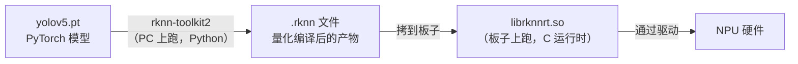
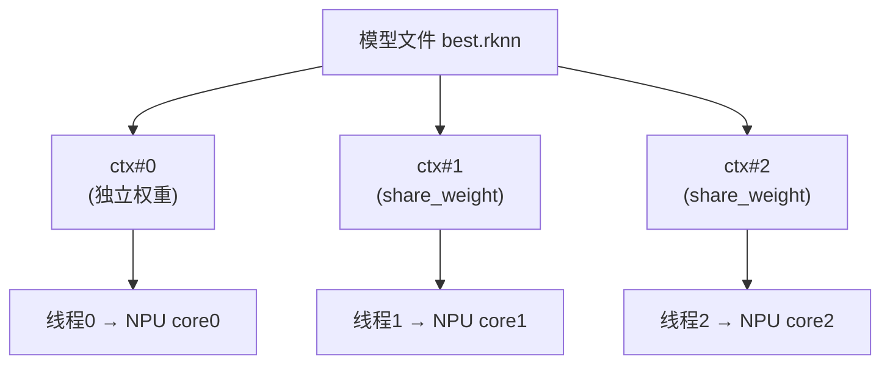

# 第 03 章 · RKNN 推理基础

## 本章目标

学完能做到：

1. 说清 `.rknn` 文件是"编译产物"、`librknnrt.so` 是"运行期引擎"，二者分工是什么
2. 独立写出 **「加载模型 → 查属性 → 绑 NPU 核心 → 喂数据 → 取输出」** 的最小闭环
3. 理解 `zp`/`scale` 为什么必须**从模型属性里动态读**，不能写死
4. 用 **RGA** 做硬件缩放，并正确实现 **letterbox**（含坐标反算）
5. 知道旧工程在预处理的哪个地方埋了坑

> 本章只讲「单帧、单线程、单模型」。多线程模型池留到第 05 章。

---

## 3.1 两个"RKNN"不是一回事



| 阶段 | 工具 | 在哪跑 | 产物 |
|---|---|---|---|
| **模型转换（编译期）** | `rknn-toolkit2`（Python） | **PC 上** | `.rknn` 文件 |
| **模型推理（运行期）** | `librknnrt.so`（C API） | **板子上** | 推理结果 |

**对本工程的含义**：
- `.rknn` 文件是**已经量化好的**（int8 或混合量化）—— 所以后处理拿到的是 **int8 数据**，必须用 `zp`/`scale` 反量化回浮点（第 04 章讲）
- 你**不需要**在板子上装 Python / rknn-toolkit2，只要有 `librknnrt.so` + 模型文件就能跑

---

## 3.2 核心对象：`rknn_context`

`rknn_context` 是一个**不透明句柄**（本质是个整数 ID / 指针），代表"一份已加载的模型 + 它的运行状态"。

```c
rknn_context ctx;                    // 就是个句柄，别去读它的内容
rknn_init(&ctx, model_data, size, 0, NULL);
```

### ⭐ 关键特性：一个 context 不能并发使用

同一时刻，**一个 `rknn_context` 只能处理一次推理**。如果你开 3 个线程调同一个 `ctx`，就要自己加锁串行化 —— 那就完全失去了多线程的意义。

**所以本工程的策略是：N 个线程 → N 个独立 context。**



---

## 3.3 模型加载：`rknn_init` vs `rknn_dup_context`

| API | 作用 | 显存 | 用途 |
|---|---|---|---|
| `rknn_init(&ctx, data, size, 0, NULL)` | 完整加载模型 | 占用完整权重 | **第一个**实例 |
| `rknn_dup_context(&src, &dst)` | 复制一个 context，**共享权重** | 只占额外的运行状态 | 第 2..N 个实例 |

**为什么要 dup**：一个 yolov5s 模型权重几 MB~几十 MB，如果 3 个实例各自完整加载，内存翻倍且加载时间翻倍。dup 让它们共享同一份权重，只复制"运行状态"。

### 代码骨架

```cpp
int rkYolov5s::init(rknn_context *ctx_in, bool share_weight)
{
    // ① 读模型文件到内存（自己实现 load_model）
    int model_size = 0;
    unsigned char *model_data = load_model(model_path.c_str(), &model_size);
    if (!model_data) return -1;

    // ② 首次用 rknn_init，其余共享权重
    int ret;
    if (share_weight)
        ret = rknn_dup_context(ctx_in, &ctx);
    else
        ret = rknn_init(&ctx, model_data, model_size, 0, NULL);

    if (ret < 0) {
        printf("rknn_init/dup error ret=%d\n", ret);
        return -1;
    }

    // ③ 后续：查询属性、绑核心（见 3.4 / 3.5）
    ...
}
```

> ⚠️ **`model_data` 的生命周期**：`rknn_init` 会**拷贝**模型数据，所以 init 成功后你**可以**释放 `model_data`。但要注意 `rknn_dup_context` 那条路径根本不需要 `model_data`（它从 `ctx_in` 复制）。旧工程两条路径都把整个文件读进了内存，属于冗余。

> ⚠️ **用完要销毁**：`rknn_destroy(ctx)`。否则反复初始化会泄漏 NPU 资源。

---

## 3.4 查询模型属性

### 四个必查的 query

```cpp
rknn_sdk_version version;
rknn_query(ctx, RKNN_QUERY_SDK_VERSION, &version, sizeof(version));
// version.api_version = librknnrt.so 的版本
// version.drv_version = 内核驱动的版本

rknn_input_output_num io_num;
rknn_query(ctx, RKNN_QUERY_IN_OUT_NUM, &io_num, sizeof(io_num));
// io_num.n_input / io_num.n_output  ← 别把输出个数写死！

rknn_tensor_attr attr;
attr.index = i;
rknn_query(ctx, RKNN_QUERY_INPUT_ATTR,  &attr, sizeof(attr));
rknn_query(ctx, RKNN_QUERY_OUTPUT_ATTR, &attr, sizeof(attr));
```

### `rknn_tensor_attr` 里必须关注的字段

| 字段 | 含义 | 为什么要看 |
|---|---|---|
| `n_dims` / `dims[]` | 张量形状 | **判断输入是 NCHW 还是 NHWC** |
| `fmt` | 排布格式 | NCHW 时 `dims[1]=channel`；NHWC 时 `dims[3]=channel` |
| `type` | 数据类型 | 通常是 `RKNN_TENSOR_INT8` |
| `qnt_type` | 量化方式 | `AFFINE` / `DFP` / `NONE` |
| **`zp`** | 零点（zero point） | **反量化必需** |
| **`scale`** | 缩放因子 | **反量化必需** |
| `n_elems` / `size` | 元素数 / 字节数 | 分配缓冲 |

### 🔴 为什么 `zp` / `scale` 必须动态读

不同的模型、不同的量化策略，`zp`/`scale` 完全不同：

```c
// ❌ 绝对不要这么写
#define SCALE 0.003921568
#define ZP    (-1)

// ✅ 必须从模型属性里取
std::vector<float>   out_scales;
std::vector<int32_t> out_zps;
for (int i = 0; i < io_num.n_output; ++i) {
    out_scales.push_back(output_attrs[i].scale);
    out_zps.push_back(output_attrs[i].zp);
}
```

**反量化公式**（第 04 章会用到）：

$$ x_{\text{float}} = \left( x_{\text{int8}} - zp \right) \times \text{scale} $$

### NCHW / NHWC 的判断

```cpp
if (input_attrs[0].fmt == RKNN_TENSOR_NCHW) {
    channel = input_attrs[0].dims[1];
    height  = input_attrs[0].dims[2];
    width   = input_attrs[0].dims[3];
} else {                       // RKNN_TENSOR_NHWC
    height  = input_attrs[0].dims[1];
    width   = input_attrs[0].dims[2];
    channel = input_attrs[0].dims[3];
}
```

**注意**：`dims` 的排列是 `[N, C, H, W]` 或 `[N, H, W, C]`，取 `channel/height/width` 时**下标不同**。写错会得到离谱的尺寸，然后 `rknn_inputs_set` 报错或输出垃圾。

---

## 3.5 NPU 核心绑定

### RK3588 的硬件事实

| 型号 | NPU 核心数 | 总算力 |
|---|---|---|
| RK3588 / RK3588S | **3 个** | 6 TOPS |

### API

```c
rknn_set_core_mask(ctx, RKNN_NPU_CORE_0);      // 绑到核心 0
rknn_set_core_mask(ctx, RKNN_NPU_CORE_1);      // 核心 1
rknn_set_core_mask(ctx, RKNN_NPU_CORE_2);      // 核心 2
rknn_set_core_mask(ctx, RKNN_NPU_CORE_AUTO);   // 由驱动自动调度
```

也可以组合（`RKNN_NPU_CORE_0_1_2` = 三核协同跑**同一个**模型），但**那是"单模型多核"模式，和本工程的"多实例各占一核"是两种不同策略**，不要混用。

### 两种策略的取舍

| 策略 | 做法 | 优点 | 缺点 |
|---|---|---|---|
| **多实例各占一核**（本工程） | 3 个 ctx，分别绑 core0/1/2 | 帧间并行，**吞吐最高** | 单帧延迟不降 |
| 单实例三核协同 | 1 个 ctx 绑 CORE_0_1_2 | **单帧延迟低** | 吞吐上不去 |
| `CORE_AUTO` | 交给驱动 | 省心 | 多进程并发时可能抢核 |

### 核心轮转分配

```cpp
// 每次 init 时取下一个核心，3 个实例就分别拿到 0/1/2
int get_core_num()
{
    static int core_num = 0;
    static std::mutex mtx;          // 注意线程安全
    std::lock_guard<std::mutex> lock(mtx);
    return core_num++ % 3;
}
```

**⚠️ 小坑**：写这种"计数器 + 取模"的函数时，如果用 `static int core_num` 放在**头文件里定义函数**，多个 `.cc` 包含它会导致重复定义。旧工程靠"只有一个文件 include 它"侥幸没出错，但这是脆的。**建议放进独立的 `.cc` 文件**，或在头文件里加 `inline`。

---

## 3.6 输入输出张量

### 输入：`rknn_input`

```c
rknn_input inputs[1] = {0};
inputs[0].index        = 0;
inputs[0].type         = RKNN_TENSOR_UINT8;   // ⭐ 给 uint8 原图，让 RKNN 自己做归一化
inputs[0].size         = width * height * channel;
inputs[0].fmt          = RKNN_TENSOR_NHWC;
inputs[0].buf          = resized_img.data;
inputs[0].pass_through = 0;                   // ⭐ 见下

rknn_inputs_set(ctx, io_num.n_input, inputs);
```

**`pass_through` 的含义**：

| 值 | 含义 |
|---|---|
| `0` | **不直通** —— RKNN 会按模型要求自动做：BGR/RGB 转换、归一化、量化（`uint8 → int8`） |
| `1` | **直通** —— 你给什么就用什么，RKNN 不做任何处理（要求你自己已经量化好） |

本工程用 `0`：**传入 uint8 的 RGB 图像，剩下的交给 RKNN**。这是最省事的做法。

**代价**：RKNN 内部要做一次量化，有开销。追求极致性能时可以自己量化后 `pass_through=1`，但那是后话。

### 输出：`rknn_output`

```c
rknn_output outputs[io_num.n_output];
memset(outputs, 0, sizeof(outputs));
for (int i = 0; i < io_num.n_output; i++)
    outputs[i].want_float = 0;      // ⭐ 直接拿 int8，不要转 float

rknn_run(ctx, NULL);
rknn_outputs_get(ctx, io_num.n_output, outputs, NULL);
// 此时 outputs[i].buf 指向 int8 数据
```

**`want_float` 的取舍**：

| 值 | 拿到什么 | 代价 |
|---|---|---|
| `0` | **int8 原始数据** | 需要自己反量化（第 04 章） |
| `1` | float32 | RKNN 帮你转换，但**多一次全量数据转换**，明显更慢 |

**本工程用 `0`** —— 因为后处理本来就是按 int8 做的（阈值比较也用 int8，更快）。

**用完必须释放**：

```c
rknn_outputs_release(ctx, io_num.n_output, outputs);
```

> ⚠️ 旧工程的一个小瑕疵：`rknn_outputs_get` 失败时直接 `return`，**没有调用 `rknn_outputs_release`**。虽然失败时通常没有分配资源，但这是不好的习惯 —— 建议在错误路径上也统一释放。

---

## 3.7 ⭐ 预处理：为什么必须有 letterbox

### 问题

模型输入固定 **640×640**，而原始图像是任意尺寸（如 1920×1080）。必须缩放。

### 两种做法的根本区别

```
原始图 1920×1080（宽高比 16:9）→ 目标 640×640（宽高比 1:1）

【直接拉伸】RGA/OpenCV 硬缩到 640×640
  目标变"扁"了 → 人变矮胖 → 模型识别精度明显下降

【letterbox】等比缩放 + 灰边填充
  1920×1080 × 0.3333 → 640×360
  上下各补 140 像素灰边 → 640×640
  目标形状不变 → 精度正常
```

### letterbox 的数学

$$\text{scale} = \min\left(\frac{640}{W},\ \frac{640}{H}\right)$$

$$\text{new\_W} = \lfloor W \cdot \text{scale} \rfloor,\quad \text{new\_H} = \lfloor H \cdot \text{scale} \rfloor$$

$$\text{pad\_w} = 640 - \text{new\_W},\quad \text{pad\_h} = 640 - \text{new\_H}$$

$$\text{pad\_left} = \lfloor \text{pad\_w}/2 \rfloor,\quad \text{pad\_top} = \lfloor \text{pad\_h}/2 \rfloor$$

### 🔴 关键：`pads` 和 `scale` 必须传给后处理

模型在"640×640 带灰边"的图上检测，输出的坐标是**这个坐标系**里的。要还原回原图：

$$x_{\text{orig}} = \frac{x_{\text{model}} - \text{pad\_left}}{\text{scale}},\qquad y_{\text{orig}} = \frac{y_{\text{model}} - \text{pad\_top}}{\text{scale}}$$

**所以 `letterbox()` 的签名里必须有 `pads` 输出参数**：

```cpp
void letterbox(const cv::Mat &image, cv::Mat &padded_image, BOX_RECT &pads,
               const float scale, const cv::Size &target_size,
               const cv::Scalar &pad_color = cv::Scalar(128, 128, 128));
```

### ⚠️ 旧工程的坑：`letterbox()` 写了但**从没被调用**

旧 `rkYolov5s.cc` 里是这样的：

```cpp
BOX_RECT pads;
memset(&pads, 0, sizeof(BOX_RECT));        // ← pads 全是 0，从没被赋值
...
ret = resize_rga(src, dst, img, resized_img, target_size);   // ← 直接拉伸
```

后果：
- 输入图像**长宽比失真** → 精度下降
- `pads` 恒为 0，后处理里 `- pads.left` 相当于没减

**好消息**：因为 `scale_w` 和 `scale_h` 是**分别**计算的（x、y 各自缩放），"无 padding 直接拉伸"在数学上是**自洽**的 —— 框的位置不会错，只是形状信息被破坏了。所以旧工程"能跑、框也画得对"，但**精度吃亏**。

**你自己写的时候，二选一，别混着来**：

| 方案 | 预处理 | 后处理 |
|---|---|---|
| A. 直接拉伸（简单） | `scale_w = 640/W`，`scale_h = 640/H`，分别算 | `x / scale_w`，`y / scale_h`，不减 pad |
| B. letterbox（推荐） | 等比 scale + 填充，记录 pads | `(x - pad_left) / scale`，`(y - pad_top) / scale` |

### 用 RGA 做硬件缩放

RGA 是独立的 2D 加速硬件，**不占 CPU、也不占 NPU**，比自己写 `cv::resize` 快得多。

```cpp
#include "im2d.h"
#include "rga.h"

// src/dst 都是 rga_buffer_t（RGA 的缓冲描述）
src = wrapbuffer_virtualaddr((void *)image.data,  image.cols,  image.rows,
                             RK_FORMAT_RGB_888);
dst = wrapbuffer_virtualaddr((void *)resized.data, target.width, target.height,
                             RK_FORMAT_RGB_888);

// 先做一次合法性检查，避免奇怪的参数导致崩溃
int ret = imcheck(src, dst, {}, {});
if (ret != IM_STATUS_NOERROR) {
    fprintf(stderr, "rga check error: %s\n", imStrError((IM_STATUS)ret));
    return -1;
}

imresize(src, dst);      // 硬件缩放
```

**注意事项**：

| 点 | 说明 |
|---|---|
| **格式是 RGB888** | RGA 的 `RK_FORMAT_RGB_888` 对应 **RGB** 顺序。OpenCV 读进来是 **BGR**，所以**必须先 `cv::cvtColor(orig, img, COLOR_BGR2RGB)`** |
| 检查返回值 | `imcheck` 先验参数；`imresize` 也要看返回值 |
| **要有回退** | RGA 失败时退回 `cv::resize`，否则整个程序挂掉 |
| 缓冲对齐 | `wrapbuffer_virtualaddr` 对内存对齐有要求，某些尺寸下 RGA 会拒绝（这时 `imcheck` 会报错） |

---

## 3.8 最小推理闭环（骨架）

把 3.3~3.7 串起来，`infer()` 的骨架长这样：

```cpp
FrameResult rkYolov5s::infer(cv::Mat &orig_img)
{
    // ① BGR → RGB（RGA 和模型都期望 RGB）
    cv::Mat img;
    cv::cvtColor(orig_img, img, cv::COLOR_BGR2RGB);

    // ② 预处理：缩放到模型输入尺寸
    //    A 方案：直接拉伸      B 方案：letterbox（推荐）
    cv::Mat resized(height, width, CV_8UC3);
    float scale_w = (float)width  / img.cols;
    float scale_h = (float)height / img.rows;
    BOX_RECT pads{0, 0, 0, 0};

    if (img.cols != width || img.rows != height) {
        if (resize_rga(img, resized, {width, height}) != 0) {
            cv::resize(img, resized, {width, height});       // 回退
        }
    } else {
        resized = img;
    }

    // ③ 喂数据
    inputs[0].buf = resized.data;
    if (rknn_inputs_set(ctx, io_num.n_input, inputs) < 0) { /* 返回空结果 */ }

    // ④ 推理
    if (rknn_run(ctx, NULL) < 0) { /* 返回空结果 */ }

    // ⑤ 取输出（int8）
    rknn_output outputs[io_num.n_output];
    memset(outputs, 0, sizeof(outputs));
    for (int i = 0; i < io_num.n_output; i++) outputs[i].want_float = 0;
    if (rknn_outputs_get(ctx, io_num.n_output, outputs, NULL) < 0) { /* 返回空结果 */ }

    // ⑥ 后处理（第 04 章）
    detect_result_group_t result;
    post_process(outputs, height, width, box_conf_threshold, nms_threshold,
                 pads, scale_w, scale_h, out_zps, out_scales, &result);

    // ⑦ 释放
    rknn_outputs_release(ctx, io_num.n_output, outputs);

    // ⑧ 返回（图像 + 检测框）
    return FrameResult{orig_img, result};
}
```

---

## 3.9 踩过的坑

| # | 坑 | 现象 | 解法 |
|---|---|---|---|
| 1 | **`zp`/`scale` 写死** | 换个模型坐标全乱 | 从 `output_attrs[i]` 动态读 |
| 2 | **`dims` 下标取错** | 尺寸离谱，推理报错或结果垃圾 | 先判断 `fmt` 是 NCHW 还是 NHWC |
| 3 | **输出个数写死为 3** | 换模型越界崩溃 | 用 `io_num.n_output` |
| 4 | **`letterbox` 写了没调用** | 能跑但精度吃亏 | 二选一，别混着来 |
| 5 | **忘了 BGR→RGB** | 检测精度下降（颜色通道反了） | `cv::cvtColor` 或用 RGA 的 `imcvtcolor` |
| 6 | **RGA 失败没回退** | 某些尺寸直接崩 | `if (ret != 0) cv::resize(...)` |
| 7 | **没调用 `rknn_destroy`** | 反复初始化后 NPU 资源耗尽 | 析构函数里销毁 |
| 8 | **`coreNum.hpp` 里定义函数** | 多文件包含时重复定义 | 放独立 `.cc` 或加 `inline` |
| 9 | **`rknn_outputs_get` 失败不释放** | 资源泄漏 | 统一走释放路径 |

---

## 3.10 验证方法

### 分阶段验证（推荐）

不要一次写完 `infer()` 再测。按这个顺序逐步确认：

**第 1 步：模型能加载**
```cpp
rknn_init(...) 之后立刻打印属性，看输出是否合理：
  期望: sdk version / driver version 各一行
        model input num: 1, output num: 3
        model input height=640, width=640, channel=3
```

**第 2 步：能绑核心**
```bash
# 运行后看 NPU 状态（如果接口可用）
cat /sys/kernel/debug/rknpu/load    # 需要 root
```

**第 3 步：能跑通一次推理**

先用 `want_float = 1` 跑一次，把输出打出来看数值范围是否合理（应该是 0~1 之间的小数，而不是一大堆 ±128 的整数）。确认没问题后再改成 `want_float = 0` 追求性能。

**第 4 步：预处理尺寸正确**
```cpp
printf("orig=%dx%d  resized=%dx%d  scale=(%.4f, %.4f)  pads=(%d,%d,%d,%d)\n", ...);
```
检查 `resized` 确实是 640×640，`scale` 在合理范围。

### 常见报错对照

| 报错 | 原因 |
|---|---|
| `rknn_init error ret=-1` | 模型文件损坏 / 架构不匹配 / 驱动版本差太多 |
| `rknn_query input attr error` | API 用法错误（`attr.index` 没设） |
| `rknn_inputs_set error ret=-1` | `inputs[0].size` 算错，或 `buf` 为空 |
| `rga check error` | 尺寸/格式不匹配，或内存对齐问题 |
| 运行期 `symbol lookup error` | `librknnrt.so` 与内核驱动版本不匹配 |

> **版本不匹配的排查**：程序启动时会打印
> `sdk version: 1.x.x  driver version: 0.9.8`
> 两者差得太远（比如 SDK 1.4 配 driver 0.9.8）可能需要更新 `librknnrt.so`。

---

## 3.11 自测问题

1. `rknn_init` 和 `rknn_dup_context` 的区别是什么？为什么本工程要多实例而不是共享一个 context？
2. 为什么 `zp` 和 `scale` 不能写成 `#define`？
3. 什么情况下 `pads` 不全为 0？后处理里的坐标反算公式是什么？
4. RGA 的 `RK_FORMAT_RGB_888` 意味着输入必须是 RGB 还是 BGR？
5. `pass_through = 0` 时 RKNN 帮你做了哪些事？
6. `want_float` 用 0 和 1 分别有什么代价？
7. 为什么说旧工程"没有用 letterbox，但框的位置是对的"？

---

## 下一章

**第 04 章 · YOLOv5 后处理**（待写）
—— int8 反量化、anchor 解码、置信度阈值、按类 NMS、检测框坐标还原。
